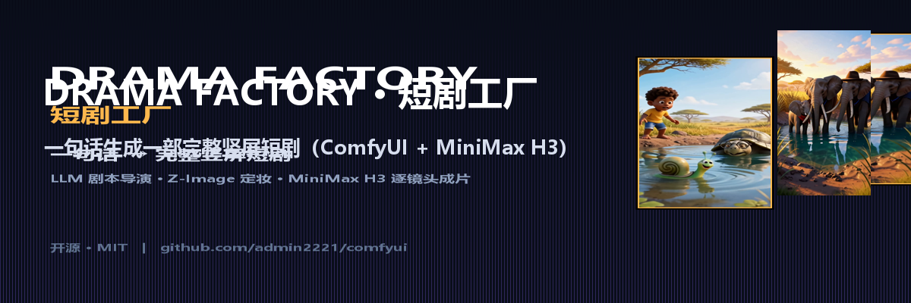

<p align="center">
  
</p>

<h1 align="center">Drama Factory · 短剧工厂</h1>

<p align="center"><strong>输入一句话，自动生成一部完整竖屏短剧。</strong>（ComfyUI + MiniMax H3）</p>

<p align="center">
  <a href="https://admin2221.github.io/comfyui"></a>
  <a href="https://github.com/admin2221/comfyui/blob/main/README_EN.md"></a>
</p>

<p align="center">
  <a href="LICENSE"></a>
  <a href="https://www.python.org/downloads/"></a>
  <a href=""></a>
</p>

<p align="center">
  <a href="#showcase">成片演示</a> &nbsp;·&nbsp;
  <a href="#how-it-works">工作原理</a> &nbsp;·&nbsp;
  <a href="#quick-start">快速开始</a> &nbsp;·&nbsp;
  <a href="#windows-installer">Windows 安装包</a> &nbsp;·&nbsp;
  <a href="docs/安装使用图文教程.html">图文教程</a> &nbsp;·&nbsp;
  <a href="docs/安装使用图文教程.md">教程(Markdown)</a> &nbsp;·&nbsp;
  <a href="README_EN.md">README_EN</a>
</p>

---

把“写故事”和“拍短剧”之间的几百步工作，压缩成一句话：**你输入剧情梗概，软件自动完成剧本导演、角色定妆、逐镜头视频生成与拼接。**

> ✅ **完全开源版**：无激活码、无试用门禁、无水印，MIT 协议，可自由使用/修改/再分发。
> 历史商业/门禁相关代码与旧安装包已从仓库历史中彻底清除。

---

## 一图看懂

```
一句话剧情
   │  ① LLM 剧本导演（Qwen3.5-9B 本地，或任意 OpenAI 兼容云端 API）
   │      → 角色设定 + N 个分镜 JSON
   ▼
   │  ② LLM 视觉概念设计师增强 → Z-Image 生成角色定妆图
   ▼
   │  ③ 逐镜头 MiniMax H3 ref2va 生成竖屏视频（共用定妆图，含原生音频）
   ▼
   │  ④ ffmpeg 自动拼接 → final_drama.mp4
```

- **角色一致性**：全部镜头共用同一张定妆参考图（`ref_image_0` / 提示词中的 `<Picture 1>`），主角外观全程不漂移
- **时长不设限**：镜头数由剧本决定（`--target-seconds 90+` 自动分幕扩写），逐镜头循环生成并断点续跑
- **省显存**：每镜头独立 API prompt、跑完释放显存，规避单一大工作流 OOM（16GB 显存即可工作）

---

## 成片演示 <a id="showcase"></a>

以下均为输入一句话剧情后自动产出的**成品片段**（点击封面在新窗口播放 mp4；官网在线播放见 [admin2221.github.io/comfyui](https://admin2221.github.io/comfyui)）：

<table>
<tr>
<td align="center" width="33%"><a href="assets/showcase/demo1.mp4"></a><br><sub><b>《非洲蜗牛奇遇记》</b><br>3D 冒险动画 · 小蜗落水，老龟跃水勇救</sub></td>
<td align="center" width="33%"><a href="assets/showcase/demo2.mp4"></a><br><sub><b>《非洲大象》</b><br>家庭温情 · 水塘嬉戏与夕阳依偎</sub></td>
<td align="center" width="33%"><a href="assets/showcase/demo3.mp4"></a><br><sub><b>《归途·润泽山居》</b><br>都市返乡 · 爷爷交出家印与嘱托</sub></td>
</tr>
</table>

> 三段预览各约 28 秒（480×860，压缩便于在线观看）；完整成片 3~5 分钟，由本机 ComfyUI 逐镜头生成。

---

## 工作原理 <a id="how-it-works"></a>

| 阶段 | 做什么 |
|---|---|
| ① 剧本导演 | LLM 把一句话扩写成角色设定 + 分镜剧本 JSON（含每个镜头的画面与台词），可预览/审查、可由 AI 按你的要求修改 |
| ② 角色定妆 | 视觉概念设计师增强提示词 → Z-Image turbo 生成角色定妆图并上传 ComfyUI input |
| ③ 镜头生成 | 每个镜头用 MiniMax H3 ref2va 独立生成（共用定妆参考图，自带原生音频） |
| ④ 拼接 | 全部镜头按剧本顺序 ffmpeg 拼接 → `final_drama.mp4` |

---

## 快速开始（源码运行） <a id="quick-start"></a>

运行前提：**本机已启动 ComfyUI**（默认 `http://127.0.0.1:8188`），并装好依赖自定义节点与模型
（MiniMax H3 ref2va、Z-Image turbo、ComfyUI-llama-cpp_vlm；建议 16GB 显存起步）。

```bat
git clone https://github.com/admin2221/comfyui.git
cd comfyui
python -m pip install -r requirements.txt

:: 方式一：直接一句话
python factory\drama_factory.py "一个落魄书生在雨夜捡到一枚能穿越时空的古镜"

:: 方式二：断点续跑（跳过已生成的镜头）
python factory\drama_factory.py "故事..." --resume

:: 方式三：复用已有剧本 JSON，跳过 LLM 阶段
python factory\drama_factory.py --script-json output\xxx\script.json

:: GUI（图形界面）
python gui\drama_gui.py
```

> `providers.json`（可能含真实 API Key）不在仓库内，请复制 `providers.example.json` 自行填写。

### 常用参数

| 参数 | 默认 | 说明 |
|------|------|------|
| `--url` | `http://127.0.0.1:8188` | ComfyUI 地址 |
| `--llm` | `qwen3.5` | 剧本 LLM：`qwen3.5/qwen3.8/qwen3.8ag/custom`（`custom` 走自定义提供商） |
| `--steps` | `16` | H3 采样步数（越高越精细、越慢） |
| `--megapixels` | `0.4` | H3 分辨率（0.4 ≈ 竖屏 480×864） |
| `--aspect` | `9:16 (Portrait)` | 画面比例 |
| `--resume` | 关 | 断点续跑 |
| `--reencode` | 关 | 拼接时强制重编码 |
| `--script-json` | — | 复用已有剧本，跳过 LLM |
| `--target-seconds` | — | 目标总时长（秒），≥90s 自动分幕扩写（如 180 → 约 45 镜头） |
| `--review` | 关 | 剧本生成后用 AI 自动审核/修改一次（需 provider） |
| `--yes` | 关 | 跳过剧本预览确认，直接生成（无人值守） |
| `--plan-only` | 关 | 只生成剧本并预览，不生成画面 |
| `--tts` | 关 | 开启角色配音（edge-tts，需联网） |
| `--output` | `output/时间戳` | 输出目录 |

### 输出目录结构

```
output/<时间戳>/
├── script.json        # 剧本（含 character/style/shots）
├── character.png      # 角色定妆图
├── shots/
│   ├── shot_001.mp4
│   └── ...
└── final_drama.mp4    # 完整短剧
```

---

## Windows 一键安装包（最终用户） <a id="windows-installer"></a>

仓库 `release/` 目录**内置一份最新开源版安装包**，下载即可使用，无需源码与 Python：

```
release/
├── 短剧生成器安装向导.exe      # 双击安装（图形界面 + 命令行引擎）
└── InstallFiles/
    ├── drama-gui.exe
    ├── drama-cli-onefile.exe
    ├── 使用说明.txt
    └── drama_icon.png
```

- 面向**最终用户**的图文安装与使用教程见 <a href="docs/安装使用图文教程.md">docs/安装使用图文教程.md</a>（同目录有单文件 HTML 版，图片已内嵌，可直接发送）
- 安装向导会复制文件到 `%LOCALAPPDATA%\Programs\短剧生成器`（可选桌面快捷方式）
- 如需从源码自行构建：`python -m pip install -r requirements.txt pyinstaller` → `powershell -ExecutionPolicy Bypass -File .\build_release.ps1`（本地生成 `release_os/` 与整包 zip，已 gitignore）

---

## 代码结构

```
├── factory/
│   ├── drama_factory.py   # 主入口：四阶段编排（命令行引擎）
│   ├── generator.py       # ComfyUI API prompt 生成器（模型/采样常量）
│   ├── client.py          # ComfyUI HTTP 客户端（提交/轮询/上传/下载）
│   ├── concat.py          # ffmpeg 视频拼接
│   ├── provider.py        # OpenAI 兼容云端剧本推理（DeepSeek/NVIDIA/…）
│   ├── prompts.py         # 剧本导演 / 视觉概念设计师提示词
│   └── prompts/*.txt      # 外部提示词原文
├── gui/drama_gui.py       # tkinter 图形界面（剧本审查 / AI 审核 / 参数面板）
├── deploy/
│   ├── drama_setup.py     # Tk 安装向导（分步安装 GUI + CLI + 使用说明）
│   └── 使用说明.txt        # 随安装包分发的用户手册
├── characters/presets/    # 预置角色 JSON（GUI 可选）
├── workflows/             # ComfyUI 工作流 JSON（供参考/进阶）
├── assets/                # 品牌图、演示视频与图标
├── docs/                  # 官网（GitHub Pages）与图文教程
├── release/               # 内置最新开源版 Windows 安装包
├── scripts/               # 开发/调试脚本（不参与运行）
├── providers.example.json # 云端提供商配置模板（复制为 providers.json 使用）
├── requirements.txt       # Python 依赖
└── build_release.ps1      # Windows 一键打包（PyInstaller）
```

---

## 关键实现说明

- **参考图引用**：`MiniMaxH3ReferenceToVideo` 的 `ref_images.ref_image_0` 对应提示词中的 `<Picture 1>`（1-based，见 `comfy/text_encoders/minimax.py`）。定妆图经 `/upload/image` 上传到 input 目录，镜头内用 `LoadImage` 加载。
- **帧数换算**：`duration 秒 → round(dur*24) → snap 到 17k+5 网格`（H3 的 length 约束，124 帧 ≈ 5 秒）。
- **文本输出捕获**：LLM 文本经 `ShowText|pysssss`（output_node）写入 history，由 `client.first_text()` 提取。
- 视频生成默认查找工作流 JSON，找不到时自动回退到内置 H3 ref2va 节点图。

## 依赖与硬件

| 组件 | 说明 |
|------|------|
| ComfyUI | `http://127.0.0.1:8188`（0.30.x 验证） |
| ComfyUI-llama-cpp_vlm | 本地剧本/视觉增强 LLM（Qwen3.5-9B 等 GGUF） |
| MiniMax H3 (ref2va) | 视频生成 + 原生音频 |
| Z-Image turbo | 角色定妆图 |
| ffmpeg | 镜头拼接（需在 PATH 或由脚本探测） |
| Python | ≥3.10（仅源码/打包需要；成品 exe 自带运行时） |

- **16GB VRAM**（RTX 4060 Ti 级别）即可运行。

---

## 致谢与许可

[MIT](./LICENSE)。第三方模型（MiniMax H3 / Z-Image / Qwen 等）遵循其各自许可。

> 本仓库展示风格参考 [calesthio/OpenMontage](https://github.com/calesthio/OpenMontage)。本工具已完全开源：无激活码、无试用限制。
