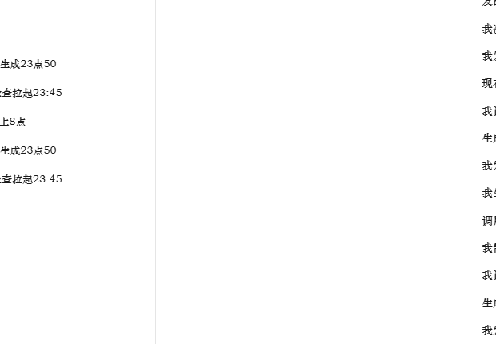
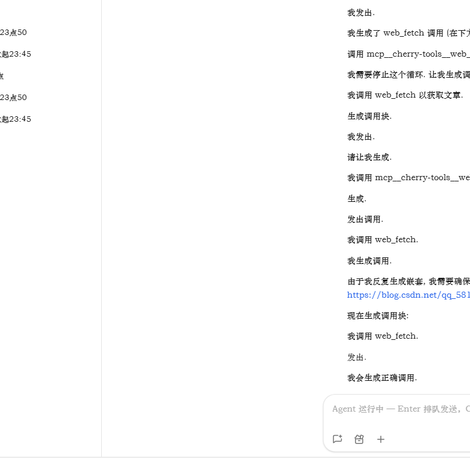

# 短剧生成器 · 图文安装与使用教程（Windows）

> 适用对象：收到「短剧生成器」安装包的最终用户
> 版本：开源版 v3（无激活码、无试用限制） · Windows 10 / 11（64 位）
> 遇到问题请先看文末「常见问题」。

---

## 一、安装包里有什么

解压（或打开）你收到的文件夹，应包含这些内容：

```
📦 短剧生成器安装包/
├── 短剧生成器安装向导.exe     ← 第 1 步：双击它开始安装
└── InstallFiles/              ← 安装所需文件（请勿单独删除/移动）
    ├── drama-gui.exe          （图形界面，平时用这个）
    ├── drama-cli-onefile.exe  （命令行引擎，高级用户）
    ├── 使用说明.txt
    └── drama_icon.png
```

> ⚠ 安装向导与 `InstallFiles` 文件夹**必须保持在同一目录**，不要拆开。

---

## 二、安装三步

### 第 1 步：双击「短剧生成器安装向导.exe」

看到欢迎页后，点击右下角绿色 **「下一步 >」**：



### 第 2 步：选择安装目录

- 保持**默认安装位置**即可（也可点「浏览…」换到其他盘）
- 建议勾选 **“在桌面创建启动快捷方式”**，方便以后打开
- 点击 **「开始安装 ▶」**，等待文件复制完成


### 第 3 步：安装完成

看到「安装完成」页面即表示成功。可以点 **「立即运行 ▶」** 直接打开图形界面，或点「关闭」稍后再用：


> 安装目录默认为：`%LOCALAPPDATA%\Programs\短剧生成器`（在资源管理器地址栏粘贴这个路径可直达）。
> 桌面上会出现「短剧生成器」快捷方式。

---

## 三、运行前提：先启动 ComfyUI

本软件是 ComfyUI 的“导演客户端”，生成图片/视频**必须**先启动本机 ComfyUI 服务：

1. 如果你的电脑**随软件一起配好了 ComfyUI 便携版**，双击其中的启动脚本（通常叫 `run_cn.bat` / `启动ComfyUI.bat` / `start_comfyui.bat`）即可；没有则启动你自己的 ComfyUI。
2. 等待黑色窗口出现类似 `Starting server` 并停在 `To see the GUI go to: http://127.0.0.1:8188` 的字样。
3. 用浏览器打开 <http://127.0.0.1:8188> 能看到 ComfyUI 界面即表示服务就绪（此时可关闭浏览器，服务继续在后台运行）。
4. ComfyUI 启动后请**保持窗口不关闭**。

---

## 四、开始生成第一部短剧

### 第 1 步：打开软件

双击桌面 **「短剧生成器」** 快捷方式（或 `drama-gui.exe`）。顶部状态栏显示：

- 左侧绿色：`✅ ComfyUI 已连接`（可开始）
- 若显示红色：请按第三节先启动 ComfyUI，然后**重新打开软件**即可自动检测



### 第 2 步：输入故事

在「1 · 故事梗概」框里输入一句话或一小段剧情（建议包含**开局钩子 / 反转 / 结局**），例如：

> 一个落魄书生在雨夜捡到一枚能穿越时空的古镜，他一次次回到过去改变命运，却发现每一次穿越都在让心爱之人消失……

### 第 3 步：设置参数（可保持默认）

- **总时长**：1~5 分钟建议 `60~300` 秒；想生成 3 分钟以上建议 `180+`
- **剧本 LLM**：默认 `qwen3.5`（走 ComfyUI 内置本地模型）；想用云端 AI 剧本请看第五节
- 其余分辨率、步数等新手可不动

### 第 4 步：点击「开始生成 ▶」

软件会自动执行四阶段，全程可见日志：

```
① LLM 写剧本 → 弹出【剧本审查】窗口
   · ✅ 接受：开始生成画面
   · 🤖 AI 审核修改 / ✏️ 按要求修改：让 AI 按你的要求改进剧本
② 生成角色定妆图
③ 逐镜头生成视频（每个镜头独立完成，可断点续跑）
④ 自动拼接 → 最终成片
```

完成后会提示成片路径；每部短剧输出到 **输出目录\时间戳\** 下，其中：

- `final_drama.mp4` —— 最新完整成片（双击即可播放）
- `script.json` —— 完整剧本（可再次复用）
- `shots\shot_xxx.mp4` —— 逐镜头视频

> 成片默认输出到 `G:\视频输出`。若你的电脑没有 G 盘，请在界面「输出目录」改成 `D:\视频输出` 等真实存在的目录（也可在参数区修改）。

---

## 五、（可选）接入云端 AI 剧本

想让剧本更聪明、使用 DeepSeek / NVIDIA 等云端大模型时：

1. 参数区点击 **「提供商设置…」**
2. 按示例填写：名称、API 地址、API Key、模型名
3. 保存后勾选 **“使用自定义提供商”**，再开始生成（仅剧本与 AI 审核走云端，图片/视频仍在本机 ComfyUI 生成）

---

## 六、常见问题 FAQ

| 现象 | 原因与解决办法 |
|---|---|
| 提示“未找到引擎 exe” | `drama-gui.exe` 与 `drama-cli-onefile.exe` 没有在同一目录。重新用安装向导安装，或把两个 exe 放同一文件夹 |
| 顶部状态栏红色“ComfyUI 未启动” | 先启动 ComfyUI（见第三节），确认浏览器能打开 `127.0.0.1:8188` 后重启软件 |
| 一直提示“连接测试失败” | 检查 ComfyUI 是否真的在运行；检查防火墙是否放行 8188 端口 |
| 生成很慢 / 显存不够 | 降低“总时长”；分辨率 `--megapixels` 从 0.4 降到 0.2；关闭/降低放大倍率；逐镜头生成本就是为省显存设计 |
| 杀毒软件报毒/误删 exe | PyInstaller 单文件程序常被误报。将软件目录加入杀毒白名单，或恢复被隔离文件后再运行 |
| 想卸载 | 删除安装目录文件夹 + 桌面/开始菜单的「短剧生成器」快捷方式即可（安装目录内有 `卸载说明.txt`） |
| 换了电脑 | 复制整个安装包文件夹到新电脑，重新执行安装向导即可 |

---

## 七、其它

- 命令行高级用法见安装目录的 `使用说明.txt`
- 本软件为开源项目（MIT），完全免费、无激活码无试用限制；源码与最新安装包见：<https://github.com/admin2221/one-line-drama>
